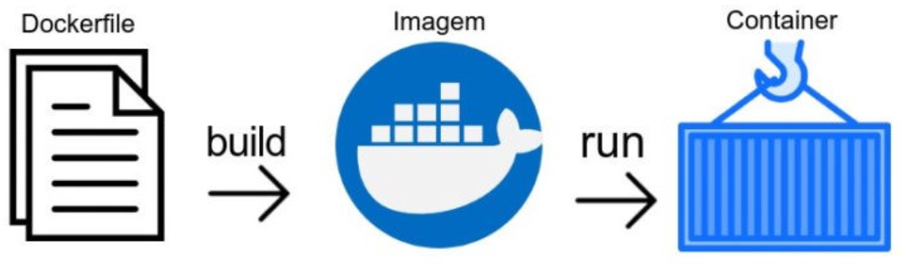

# Bioinformatics analyses using Docker and Conda environment

This protocol was developed for creating and configuring Docker containers and Conda environment for bioinformatics analyses.

## What is necessary to run this protocol:
- A machine running any operating system (such as Linux, Windows or macOS) and Docker App
- Minimum or zero command-line knowledge

## Summary
1. [What is necessary to run this protocol](#what-is-necessary-to-run-this-protocol)
2. [Docker installation](#docker-installation)
3. [For windows](#for-windows)
4. [For Linux](#for-linux)
5. [For macOS](#for-macos)
6. [Creating a Docker container from scratch](#creating-a-docker-container-from-scratch)
7. [Download a Linux official image from the Docker hub](#download-a-linux-official-image-from-the-docker-hub)
8. [Minimum commands to manage Docker images and containers](#minimum-commands-to-manage-docker-images-and-containers)

## Docker installation

### For windows
Access the “Get Docker” website (https://docs.docker.com/get-docker/), and click on the get started. Find the installer for Docker Desktop For Windows. Download the files and install them locally on the computer.

After download, start the installation file (.exe) and keep the default parameters. Make sure that these two options “Install required Windows components for WSL 2” and “Add shortcut the desktop” are marked.

NOTE: In some cases, when this software tries to start the service, it shows an error: “WSL installation is incomplete”. To figure out this error, access the website WSL2-Kernel and follow up the instructions (https://docs.microsoft.com/en-us/windows/wsl/wsl2-kernel).

Download and install the “latest WSL2 Linux kernel”.

Access PowerShell terminal as Administrator and execute the command:
```
dism.exe /online /enable-feature /featurename:Microsoft-Windows-Subsystem-Linux /all /norestart
```

Ensure that the software Docker Desktop is installed successfully. You will see an icon close to the date and clock.

### For Linux
Access the “Get Docker Linux” website (https://docs.docker.com/get-docker/) and follow the instructions for installing.

Update all Linux packages using the command line:
```
sudo apt-get update
```

Install required packages to the Docker program:
```
sudo apt-get install apt-transport-https ca-certificates curl gnupg lsb-release
```

Create a software archive keyring file:
```
curl -fsSL https://download.docker.com/linux/ubuntu/gpg | sudo gpg --dearmor -o /usr/share/keyrings/docker-archive-keyring.gpg
```

Add Docker deb information in the source.list file.
```
echo "deb [arch=amd64 signed-by=/usr/share/keyrings/docker-archive-keyring.gpg] https://download.docker.com/linux/ubuntu $(lsb_release -cs) stable" | sudo tee /etc/apt/sources.list.d/docker.list > /dev/null
```

Update all packages again, including recently added ones.
```
sudo apt-get update
```

Install the Docker Desktop.
```
sudo apt-get install docker-ce docker-ce-cli containerd.io
```

Select the geographic area and time zone to finish the installation process.

To ensure the Docker App is working, typing the command at the terminal
'''
docker --servion
'''

### For macOS
Access the “Get Docker” website (https://docs.docker.com/get-docker/), click on “Docker Desktop for Mac”, and choose the Docker installation file for “Intel chip” or “Apple chip”.

Execute the Docker.dmg file to open the installer, then drag the icon to the Applications folder. Localize and execute the Docker.app in the Applications folder to start the program.

NOTE: The software specific menu in the top status bar indicates that the software is running and that it is accessible from a terminal.

## Creating a Docker container from scratch
### Download a Linux official image from the Docker hub
Access the Docker hub website (https://hub.docker.com/), and look for “miniconda3” image.

Open the Operating System terminal and execute the commands:
```
docker run -i -t -v <local machine path>:/home continuumio/miniconda3 /bin/bash
```
* <local machine path> => C:\Users\Andre.Nicolau\Documents\Projects

Installing Htop program on the Docker container
```
(base) root@a95e814ebc80:/# apt update
(base) root@a95e814ebc80:/# apt upgrade
(base) root@a95e814ebc80:/# apt install htop
```

Downloading mamba environment management
```
(base) root@a95e814ebc80:/# conda install -c conda-forge mamba
```

Downloading an example pipeline (for more information about this snakemake pipeline, access here: https://snakemake.readthedocs.io/en/stable/tutorial/basics.html)
```
(base) root@a95e814ebc80:/# cd /home/<specific folder>
(base) root@a95e814ebc80:/# git clone https://github.com/ehpc-lab/docker-conda-course.git
(base) root@a95e814ebc80:/# cd docker-conda-course/
```

Installing the tutorial environment
```
(base) root@a95e814ebc80:/# mamba env create -n tutorial --file environment.yaml
(base) root@a95e814ebc80:/# conda activate tutorial
```

Executing the snakemake pipeline
```
(base) root@a95e814ebc80:/# snakemake --cores <number of cores>
(base) root@a95e814ebc80:/# snakemake --cores 7
```

## Minimum commands to manage Docker images and containers


The main elements of Docker are Dockerfile, Image and Container. For this tutorial, we do not use the Dockerfile and how to build up to it for the moment. 

**What is a Dockerfile?**
<p>A Dockerfile is a text document that contains all the commands a user could call on the command line to assemble an image. Using docker build users can create an automated build that executes several command-line instructions in succession. This page describes the commands you can use in a Dockerfile</p>

**What is a Docker image?**
<p>A Docker image is a file used to execute code in a Docker container. Docker images act as a set of instructions to build a Docker container, like a template. Docker images also act as the starting point when using Docker. An image is comparable to a snapshot in virtual machine (VM) environments.</p>

**What is a container in Docker?**
<p>A Docker container image is a lightweight, standalone, executable package of software that includes everything needed to run an application: code, runtime, system tools, system libraries and settings.</p>

Check out more details about any Docker command accessing this documentation: https://docs.docker.com/

Download Docker image
```
docker pull <NAME>
```
* The Docker image NAME is accessible in the Docker hub website.

An example of docker pull command:
```
docker pull continuumio/miniconda3
```

The Docker image can be downloaded using the Docker run command only.
```
docker run -i -t --name CSBL -v <local machine directory path>:/home continuumio/miniconda3 /bin/bash
```
* <local machine path> => C:\Users\Andre.Nicolau\Documents\Projects

Leaving from the Docker container
```
(base) root@a95e814ebc80:/# exit
```

How to left a Docker container running in background? In your personal OS terminal, execute the docker run command using -d parameter.
```
docker run -i -t -d --name CSBL -v <local machine path>:/home continuumio/miniconda3 /bin/bash
docker container ls
docker exec -i -t CSBL /bin/bash
```
* <local machine path> => C:\Users\Andre.Nicolau\Documents\Projects

How to stop a Docker container
```
docker container stop (<CONTAINER ID> or <CONTAINER NAME>)
docker container stop CSBL
```

**Starting another Docker container from the same Docker image.**

List of Docker images
```
docker images
```

Copy the IMAGE ID information and paste on the Docker run command
```
docker run -i -t -d --name CSBL -v <local machine path>:/home <IMAGE ID> /bin/bash
```
* <local machine path> => C:\Users\Andre.Nicolau\Documents\Projects

Check out the Docker container list.
```
docker container ls
```

Copy the CONTAINER ID or CONTAINER NAME information to start the container

Run the existed Docker container
```
docker exec -i -t (<CONTAINER ID> or <CONTAINER NAME>) /bin/bash
```

Login
```
docker login --username=<USER>
```

Save a Docker container as an image and deposit on your personal Docker hub account
```
docker commit <CONTAINER ID> <USER>/<IMAGE NAME>
docker commit <CONTAINER ID> anicolau/CSBLCourse
```

Check out the new image from Docker container
```
docker images ls
```
  
Tag and submit the new image for the Docker hub
```
docker tag <NEW IMAGE ID> <USER>/<IMAGE NAME>
docker push <USER>/<IMAGE NAME>
  
docker tag <NEW IMAGE ID> anicolau/CSBLCourse
docker push anicolau/CSBLCourse
```

## Conda environment

Create an environment
```
(base) root@a95e814ebc80:/# conda create --name <ENV NAME>
(base) root@a95e814ebc80:/# conda create --name tutorial
```

Activate environment
```
(base) root@a95e814ebc80:/# conda activate <ENV NAME>
(base) root@a95e814ebc80:/# conda activate tutorial
```

Install packages using mamba
```
(tutorial) root@a95e814ebc80:/# conda install -c conda-forge mamba
(tutorial) root@a95e814ebc80:/# mamba init
(tutorial) root@a95e814ebc80:/# mamba install <PACKAGE NAME>
(tutorial) root@a95e814ebc80:/# mamba install -c bioconda bowtie2
```

If your conda env is already activated, use:
```
(tutorial) root@a95e814ebc80:/# mamba env update --file environment.yaml
```

Or update a specific environment without activating it:
```
(base) root@a95e814ebc80:/# mamba env update --name tutorial --file environment.yaml
```

Add channel
```
(tutorial) root@a95e814ebc80:/# conda config --add channels new_channel
```

Nested activation
```
(base) root@a95e814ebc80:/# conda activate --stack <ENV NAME>
```

Conda deactivation
```
(tutorial) root@a95e814ebc80:/# conda deactivate
(base) root@a95e814ebc80:/#
```
